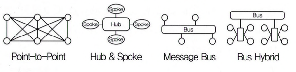

# 인터페이스 구현 정리

## 1. 요구사항 검증 방법

요구사항 명세서가 완전하고 일관되며 명확한지 확인하는 과정으로, 다음과 같은 방법들이 사용된다.

- **동료 검토 (Peer Review)**: 같은 팀 또는 다른 개발자가 문서를 검토
- **워크스루 (Walkthrough)**: 작성자가 설명하고 참가자가 질문하며 오류를 찾는 방식
- **인스펙션 (Inspection)**: 명확한 체크리스트를 기준으로 오류를 찾고 기록
- **기타 방법**: 프로토타이핑, 테스트 설계, CASE 도구 활용 등

---

## 2. 미들웨어 (Middleware)

운영체제와 응용 프로그램 사이에서 통신, 데이터 관리, 보안 등을 지원하는 **중간 소프트웨어**로, 분산 시스템 구성에 핵심 역할을 한다.

---

## 3. 미들웨어의 종류

| 종류                                | 설명                                                         |
| ----------------------------------- | ------------------------------------------------------------ |
| DB (DateBase)                       | 응용 프로그램과 데이터베이스 간 연결을 지원 (예: ODBC, JDBC) |
| RPC (Remote Procedure Call)         | 원격 프로시저 호출(Remote Procedure Call)을 가능하게 함      |
| MOM (Message Oriented Middleware)   | 메시지 지향 미들웨어, 메시지 기반 비동기 통신 (예: MQ)       |
| ORB (Object Request Broker)         | 객체 요청 브로커, 객체 간 통신을 지원 (예: CORBA)            |
| TP Monitor (Transaction Processing) | 트랜잭션 처리 미들웨어로 안정성 및 병행성 제어 기능 제공     |

---

## 4. EAI (Enterprise Application Integration)

기업 내 각 기종 시스템과 애플리케이션을 통합하여 **데이터 및 프로세스 연동**을 지원하는 기술

### EAI 구성 방식

| 방식           | 설명                                            |
| -------------- | ----------------------------------------------- |
| Point-to-Point | 1:1 직접 연결 방식, 구조 단순하지만 확장성 낮음 |
| Hub & Spoke    | 중앙 허브가 각 시스템과 연결, 관리 용이         |
| Message Bus    | 메시지 버스 형태로 통신, 유연성과 확장성 우수   |
| Bus Hybrid     | Hub & Spoke와 Message Bus를 혼합 사용           |



---

## 5. JSON (JavaScript Object Notation)

- 경량의 **데이터 교환 포맷**
- 텍스트 기반이며 사람이 읽고 쓰기 쉬움
- 구조는 속성-값 (Attribute - Value) 쌍의 형태

### 예시

```json
{
  "name": "Kim",
  "age": 25,
  "email": "kim@example.com"
}
```

---

## 6. AJAX (Asynchronous JavaScript And XML)

- 웹 페이지 전체를 다시 로드하지 않고, 서버와 **비동기 통신**을 통해 일부 데이터만 갱신
- 사용자 경험 개선에 효과적

### 핵심 구성 요소

- XMLHttpRequest 객체
- JavaScript
- 서버 스크립트 (PHP, Node.js 등)

---

## 7. 인터페이스 보안 기능 적용

인터페이스 구현 시 데이터의 **무결성, 기밀성, 인증, 부인 방지** 등을 보장해야 하며, 이를 위해 다양한 보안 기술을 적용한다.

| 영역              | 설명                                                                                                       |
| ----------------- | ---------------------------------------------------------------------------------------------------------- |
| 네트워크 영역     | 송·수신 간 스니핑(Sniffing) 등 데이터 탈취 방지를 위해 트래픽 암호화 설정. IPSec, SSL, S-HTTP 등 방식 사용 |
| 애플리케이션 영역 | 개발 보안 가이드를 참고하여 애플리케이션 코드상의 보안 취약점을 보완하는 기능 적용                         |
| 데이터베이스 영역 | DB, 스키마, 엔터티 접근 권한과 프로시저, 트리거 등의 동작 객체 보안 취약점에 기능 적용                     |

---

## 8. 인터페이스 보안 프로토콜

| 프로토콜 | 설명                                                         |
| -------- | ------------------------------------------------------------ |
| IPsec    | IP 계층에서 데이터 패킷을 암호화하여 송수신, VPN 구성에 활용 |
| SSL      | 전송 계층에서 데이터 암호화 및 인증 제공, 현재는 TLS가 대체  |
| S-HTTP   | HTTP 메시지 단위로 보안 처리, 현재는 거의 사용되지 않음      |

---

## 9. 데이터 무결성 검사 도구

데이터 전송 중 변경, 손상 여부를 확인하는 도구로, **해시 함수나 체크섬** 등을 이용한다.

종류: Tripwire, AIDE, Samhain, Claymore, Slipwire, Fcheck 등

## 10. 인터페이스 구현 검증 도구

시스템 간 연동이 제대로 수행되는지 확인하는 도구로, 다음과 같은 방식이 있다.

| 도구 이름                                    | 설명                                                                               |
| -------------------------------------------- | ---------------------------------------------------------------------------------- |
| xUnit                                        | 단위 테스트 프레임워크 계열로, JUnit, NUnit 등 다양한 언어 기반 테스트 도구의 집합 |
| STAF (Software Testing Automation Framework) | 테스트 환경 자동화를 위한 프레임워크로 다양한 컴포넌트와 스크립트 연동 가능        |
| FitNesse                                     | 웹 기반 테스트 도구로, 요구사항 명세와 테스트를 문서 형태로 통합하여 테스트 가능   |
| NTAF (Nexial Test Automation Framework)      | 키워드 기반 자동화 프레임워크로, 테스트 자동화의 생산성과 유지보수성 향상          |
| Selenium                                     | 웹 애플리케이션의 UI 테스트 자동화 도구, 다양한 브라우저와 언어 지원               |
| watir                                        | 루비 기반의 웹 애플리케이션 테스트 도구로, 사용자 시나리오를 자동화함              |
